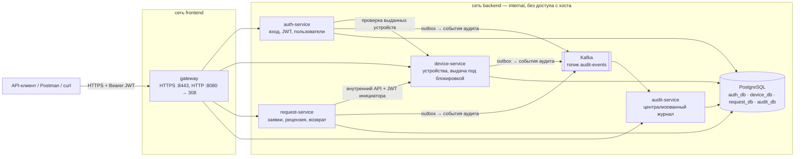

# Школьная система инвентаризации — микросервисное приложение

Реализация продукта из [PROJECT.md](../PROJECT.md) с учётом модели угроз
[threat-model.md](../threat-model.md), требований [security-requirements.md](../security-requirements.md)
и проектных решений [design-decision.md](../design-decision.md).

Стек: **C# / .NET 9 (ASP.NET Core Minimal API)**, **PostgreSQL 17**, **Apache Kafka 3.8 (KRaft)**,
**YARP** (шлюз), **Docker Compose**.

## Архитектура



| Контейнер | Назначение | База данных |
| --- | --- | --- |
| `gateway` | Единая точка входа. TLS, перенаправление HTTP → HTTPS, HSTS, ограничение частоты входа, маршрутизация. Внутренние маршруты `/internal/*` наружу не публикуются. | — |
| `auth-service` | `POST /auth/login`, выпуск JWT, блокировка после неудачных попыток, управление учениками и учителями. | `auth_db` |
| `device-service` | Каталог устройств и их статусы. Окончательная проверка лимита SR-08 при выдаче. | `device_db` |
| `request-service` | Заявки учеников, рецензирование, оркестрация выдачи и возврата. | `request_db` |
| `audit-service` | Читает события из Kafka и хранит централизованный журнал аудита. | `audit_db` |
| `postgres` | У каждого сервиса своя база и свой пользователь без доступа к чужим базам. | — |
| `kafka` | Транспорт событий аудита. | — |

## Запуск

**Требования:** Docker Desktop или Docker Engine с Compose v2. Порты 8080 и 8443 на хосте должны быть свободны.

```bash
cd application
cp .env.example .env        # затем замените пароли и JWT_SIGNING_KEY
docker compose up -d --build
docker compose ps           # все 7 контейнеров в состоянии running
```

Первый запуск создаёт базы данных, администратора из `ADMIN_LOGIN` / `ADMIN_PASSWORD` и,
при `SEED_DEMO_DATA=true`, демонстрационные данные: `teacher01`, `student01`, `student02`
с паролем `DEMO_PASSWORD` и 8 устройств.

**Проверка запуска:**

```bash
curl -k https://localhost:8443/auth/login \
  -H "Content-Type: application/json" \
  -d '{"login":"admin","password":"<ADMIN_PASSWORD>"}'
```

**Ожидаемый результат:** HTTP 200 и JSON с полями `accessToken`, `expiresAt` и `user`.
Запрос `curl -i http://localhost:8080/devices` возвращает `308` с переходом на `https://`.

Шлюз использует самоподписанный сертификат для `localhost`, поэтому в curl нужен ключ `-k`.
В Postman отключите *SSL certificate verification* или добавьте сертификат в доверенные:

```bash
docker compose cp gateway:/https/gateway.crt ./gateway.crt
```

Чтобы подключить свой сертификат, положите PFX в том `gateway-certs` по пути `/https/gateway.pfx`
и задайте `CERT_PASSWORD`.

**Остановка:** `docker compose down`. Полный сброс данных: `docker compose down -v`.

## Автоматические проверки

```bash
dotnet test InventorySystem.sln          # модульные тесты: правило SR-08, учебное время, форматы
bash scripts/smoke-test.sh               # сквозная проверка 3 сценариев и угроз через шлюз
bash scripts/kafka-outage-test.sh        # SR-03: отказ и восстановление Kafka
```

Скрипты рассчитаны на bash и curl (Git Bash на Windows или Linux) и читают пароли из `.env`.
Сквозной проверке нужны демонстрационные данные.

> [!NOTE]
> В Git Bash на Windows кириллица в аргументах curl искажается. Передавайте JSON с русским текстом
> из файла: `--data-binary @body.json`. В Postman этой проблемы нет.

## API

Все операции, кроме `POST /auth/login`, требуют заголовок `Authorization: Bearer <accessToken>`.
Перечисления передаются строками в нижнем регистре: `available`, `vr_headset`, `approved`.

| Операция | Роль | Пример тела |
| --- | --- | --- |
| `POST /auth/login` | любая | `{"login":"student01","password":"..."}` |
| `POST /auth/logout`, `GET /auth/me` | любая | — |
| `GET /users?role=student` | администратор, учитель | — |
| `POST /users` | администратор | `{"name":"Иван Иванов","login":"ivanov","role":"student","confirmation":"Подтверждаю"}` |
| `DELETE /users/{userId}?confirmation=Подтверждаю` | администратор | — |
| `GET /device-types` | любая | — |
| `GET /devices?status=available&type=laptop` | любая | — |
| `GET /devices/{deviceId}` | любая | — |
| `POST /devices` | администратор | `{"name":"MacBook Air","type":"laptop","status":"available"}` |
| `PATCH /devices/{deviceId}` | администратор | `{"status":"maintenance"}` |
| `POST /requests` | ученик | `{"deviceId":"<guid>","comment":"Для проекта"}` |
| `GET /requests/my` | ученик | — |
| `GET /requests/{requestId}` | учитель, ученик-владелец | — |
| `GET /requests?status=pending&studentId=<guid>` | учитель | — |
| `PATCH /requests/{requestId}/review` | учитель | `{"decision":"approved"}` или `{"decision":"rejected","comment":"..."}` |
| `PATCH /devices/{deviceId}/return` | учитель | — |
| `GET /audit?severity=warning&action=...&from=...&limit=100` | администратор | — |
| `GET /audit/warnings` | администратор | — |

Типы устройств: `laptop`, `tablet`, `smartphone`, `monitor`, `camera`, `vr_headset`,
`microcontroller`, `router`. Статусы: `available`, `issued`, `maintenance`, `decommissioned`.
Статус `issued` устанавливается только при одобрении заявки.
Статусы заявок: `pending`, `approved`, `rejected`, `returned`.

Ошибки возвращаются в формате Problem Details с машиночитаемым полем `code`, например
`device_limit_reached`, `duplicate_device_type`, `foreign_request`, `confirmation_required`.

## Как реализованы требования безопасности

| Требование | Угроза / решение | Реализация |
| --- | --- | --- |
| SR-01 | T-01, D-01 | JWT (HS256, срок 30 мин) проверяется в каждом сервисе. Fallback-политика требует аутентификации, если у операции забыта своя политика. Без токена ответ `403` с текстом «Требуется авторизация». |
| SR-02 | T-02 | Вход и выход, изменения пользователей, устройств и заявок пишутся в журнал: кто, что, над чем, когда, результат, IP. Предупреждения ставятся на 3 и более неудачных входа подряд, блокировку учётной записи, превышение полномочий, попытку открыть чужую заявку и действия вне учебного времени. |
| SR-03 | T-03 | Transactional Outbox: событие пишется в таблицу `audit_outbox` базы сервиса в одной транзакции с изменением. Фоновая задача отправляет события в Kafka и повторяет попытки при отказе. Записи остаются в базе как локальный журнал. `audit-service` сохраняет события идемпотентно. |
| SR-04 | T-04 | Наружу открыт только шлюз. API работает по HTTPS, HTTP отвечает `308` на HTTPS, включён HSTS. Сервисы, PostgreSQL и Kafka находятся во внутренней сети Docker без публикации портов. |
| SR-05 | T-05 | Создание и удаление пользователей доступно только роли `admin` и требует фразы «Подтверждаю». Через API можно создать только `student` и `teacher`. Нельзя удалить ученика с невозвращёнными устройствами. |
| SR-06 | T-06, D-01 | `POST/PATCH /devices` доступны только администратору. Изменение статуса и типа выданного устройства запрещено до возврата. |
| SR-07 | T-07, D-01 | Рецензирование и возврат доступны только учителю. Внутренний API выдачи в `device-service` сам ещё раз проверяет роль учителя по пересланному JWT. |
| SR-08 | T-08, D-02 | Предварительная проверка при создании заявки учитывает выданные и ожидающие устройства. Окончательная проверка идёт при одобрении в `device-service` в одной транзакции с advisory-блокировкой на ученика и `SELECT … FOR UPDATE` на устройство. Уникальный индекс `(holder_id, type)` в БД — последний рубеж. |
| SR-09 | T-09, D-03 | `GET /requests/my` выбирает заявки только по `sub` из токена. `GET /requests/{id}` для чужой заявки отвечает `403` и пишет предупреждение в аудит. |

Дополнительно: пароли хешируются PBKDF2 через `PasswordHasher` из ASP.NET Core Identity.
Учётная запись блокируется на 15 минут после 5 неудачных попыток. Шлюз ограничивает вход
10 попытками в минуту с одного адреса. Контейнеры .NET работают от непривилегированного пользователя.

## Допущения и ограничения

- **403 вместо 401.** SR-01 требует отвечать неавторизованному пользователю `403 Forbidden`. Приложение следует требованию, хотя по соглашениям HTTP здесь обычно возвращают `401`.
- **Нет GUI.** Пункты требований про уведомления в GUI выполнены через тексты ошибок API, а подтверждение SR-05 передаётся полем `confirmation`.
- **Выход без отзыва токена.** `POST /auth/logout` фиксирует выход в аудите. Сам JWT остаётся действительным до истечения срока, поэтому срок жизни короткий.
- **Внутренний трафик по HTTP.** Граница доверия проходит по шлюзу. Сервисы общаются по HTTP во внутренней изолированной сети Docker. Для продуктивной среды стоит добавить mTLS.
- **Схема БД.** Схема создаётся при старте через `EnsureCreated`. Для развития схемы стоит перейти на миграции EF Core.

## Структура

```
application/
├── docker-compose.yml          # 7 контейнеров, сети frontend/backend, тома
├── .env.example                # шаблон секретов и настроек
├── infra/postgres/init/        # создание баз и пользователей сервисов
├── src/
│   ├── Inventory.Shared/       # JWT и роли, аудит + outbox + Kafka, правило SR-08
│   ├── Inventory.Gateway/      # YARP, TLS, rate limiting
│   ├── Inventory.AuthService/
│   ├── Inventory.DeviceService/
│   ├── Inventory.RequestService/
│   └── Inventory.AuditService/
├── tests/Inventory.Tests/      # xUnit
└── scripts/                    # сквозные проверки на bash + curl
```
